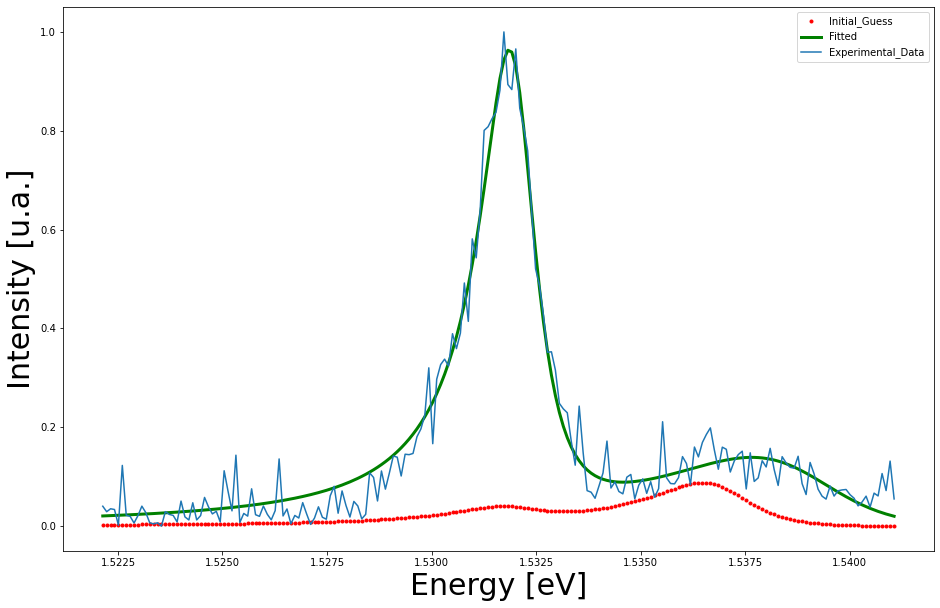

# PL-Nonlinear-Least-Squares-Fit
Fit by Nonlinear Least Squares the parameters of the Photoluminiscence Spectra of Coupled Quantum Wells to a Lorentzian or Gaussian lineform. Or any another phenomena with a known lineform that you want to propose.

* Item This code was development for a Physical Engenering degree tesis, where we are trying fit by Nonlinear Least Squares the parameters of the Photoluminiscence Spectra of Coupled Quantum Wells.

In these spectra see two transitions, for this reason we propose a sum of Gaussians or Lorentzians. The Fit is temperature dependent.

In the written work, we propouse Gaussians, but we have saw later that Lorentzians are a better bet.

Being an iterative method, we need to initialize the variables in the next order:
    
   [Mean1,DeltaMean=Mean2-Mean1, Halfwidth1, Halfwidth2, Intensity0_1, Intensity0_2]
   
Defining DeltaMean we make sure that the second transition will be diferent from the
first.

While better be the initial guess, faster and correct will be the fit.

For more information see the attached thesis.

  

